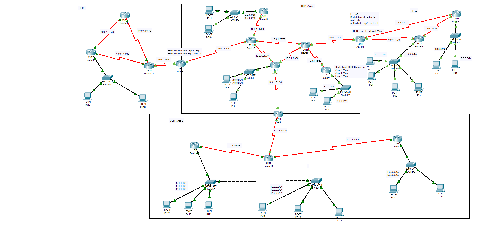

# 🌐 Full Routing Protocolس Topology — Multi-Domain Enterprise Network

> A comprehensive Cisco Packet Tracer simulation of an enterprise-grade multi-protocol network, integrating OSPF (Multi-Area), EIGRP, and RIPv2 with full redistribution, VLAN segmentation, centralized DHCP, and Layer 2 security hardening.

---

## 🖼️ Network Topology



---

## 📌 Project Overview

This project simulates a real-world enterprise network environment built entirely in **Cisco Packet Tracer**. It demonstrates deep knowledge of routing protocols, inter-domain redistribution, VLAN design, and switching security — covering skills typically required in CCNA/CCNP-level deployments.

The topology spans **three routing domains** interconnected through **ASBR routers**, with **23+ routers**, **9+ managed switches**, and **22+ end devices** across logically separated network zones.

---

## 🗺️ Topology Breakdown

### Routing Domains

| Domain | Protocol | Area/Process | Notes |
|---|---|---|---|
| Core Backbone | OSPF Area 0 | Process 1 | Backbone area connecting all zones |
| Branch Zone | OSPF Area 1 | Process 1 | Multi-router spoke area |
| Legacy Zone | RIPv2 | — | Redistributed subnets enabled |
| Remote Zone | EIGRP | AS (custom) | Full mesh partial topology |

### Key Network Segments (Point-to-Point Links)

| Link | Subnet | Connected Routers |
|---|---|---|
| ASBR2 ↔ OSPF Area 1 | 10.0.1.40/30 | ASBR2 — Router3 |
| Router3 ↔ Router4 | 10.0.1.20/30 | Router3 — Router4 |
| Router4 ↔ ASBR1 | 10.0.1.12/30 | Router4 — ASBR1 |
| ASBR1 ↔ Router2 | 10.0.1.4/30 | ASBR1 — Router2 |
| ABR ↔ Router11 | 10.0.1.44/30 | ABR — Router11 |
| Router11 ↔ Router10 | 10.0.1.52/30 | Router11 — Router10 |
| ABR ↔ Router9 | 10.0.1.48/30 | ABR — Router9 |
| EIGRP Zone | 10.0.1.56–1.68/30 | Router13–Router15–Router16 |

---

## 📐 IP Addressing Strategy

A deliberate and efficient IP addressing plan was applied across the entire topology:

| Address Block | Purpose | Mask | Reason |
|---|---|---|---|
| `10.0.1.x` | All point-to-point links between routers | `/30` | Exactly 2 usable IPs — zero waste |
| `x.0.0.0` (8, 9, 11, 12…) | LAN segments for end devices | `/24` | Simple, readable host ranges |
| `6.0.0.0 / 7.0.0.0` | VLAN segments (OSPF Area 1) | `/24` | Per-VLAN isolation |
| `15.0.0.0 / 16.0.0.0` | VLAN segments (OSPF Area 0) | `/24` | Per-VLAN isolation |
| `12–14.0.0.0` | OSPF Area 0 LANs (dual-side) | `/24` | Symmetric design across switches |

### Why /30 on every P2P link?

A `/30` subnet provides exactly **4 IPs**: network address, 2 usable host IPs, and broadcast — perfect for a router-to-router link with no waste. Using `/24` instead would waste **252 IP addresses per link**. With **15+ point-to-point links** in this topology, the /30 strategy saves **3,700+ IP addresses** compared to a naive /24 design.

All P2P links are grouped under the `10.0.1.0/24` block, making them instantly recognizable and easy to filter in routing tables and troubleshooting sessions.

---

## ⚙️ Features & Implementation Details

### 🔁 Routing Protocols & Redistribution

- **OSPF Multi-Area** (Area 0 + Area 1) with proper ABR and ASBR roles
- **EIGRP** deployed in the remote zone with partial mesh topology
- **RIPv2** with `redistribute rip subnets` for classless routing
- **Bidirectional redistribution** on both ASBR1 and ASBR2:
  - `redistribute ospf 1 metric 1` → into RIP
  - `redistribute rip` → into OSPF
  - `redistribute ospf to eigrp` and vice versa on ASBR2
- Route loop prevention considerations applied at redistribution boundaries

### 🏢 VLAN Design & Router-on-a-Stick

Every router connected to a managed switch uses **Router-on-a-Stick** (IEEE 802.1Q subinterfaces):

```
interface GigabitEthernet0/0.10
 encapsulation dot1Q 10
 ip address 192.168.10.1 255.255.255.0
!
interface GigabitEthernet0/0.20
 encapsulation dot1Q 20
 ip address 192.168.20.1 255.255.255.0
```

- Each subinterface serves a dedicated VLAN
- VLANs span: Area 1 VLANs, Area 0 VLANs, EIGRP VLANs, RIP Network VLANs

### 📡 Centralized DHCP Server (Router-Based)

A single router acts as the **centralized DHCP server** for all VLANs across the topology:

- Separate DHCP pools per VLAN/subnet
- `ip helper-address` configured on each subinterface to relay DHCP requests
- Serves clients in: Area 1 VLANs, Area 0 VLANs, EIGRP zone VLANs

```
ip dhcp pool VLAN10
 network 192.168.10.0 255.255.255.0
 default-router 192.168.10.1
 dns-server 8.8.8.8
!
ip dhcp excluded-address 192.168.10.1 192.168.10.10
```

### 🔒 Layer 2 Security Hardening

All access-layer switches are hardened with:

| Feature | Configuration |
|---|---|
| **PortFast** | `spanning-tree portfast default` (global mode on all access ports) |
| **BPDUGuard** | `spanning-tree portfast bpduguard default` (global) |
| **Port Security** | Enabled on access ports — limits MAC addresses per port |
| **Trunking** | 802.1Q trunks on uplinks to routers and inter-switch links |
| **Access Ports** | Assigned to correct VLANs, no DTP negotiation |

---

## 🧪 Connectivity Verification

End-to-end reachability confirmed across all routing domains via ping and traceroute:

### Cross-Domain Ping Tests

```
Source: 17.0.0.16 (EIGRP Zone)

ping 8.0.0.16  → SUCCESS (RIPv2 Zone)   TTL=121  avg 12ms
ping 14.0.0.16 → SUCCESS (OSPF Area 0)  TTL=120  avg 14ms
```

### Traceroute Analysis

**EIGRP → RIPv2 (9.0.0.16)** — 8 hops:
```
17.0.0.1 → 10.0.1.61 → 10.0.1.57 → 10.0.1.41 → 10.0.1.21 → 10.0.1.14 → 10.0.1.9 → 9.0.0.16
```
Path: EIGRP Zone → ASBR2 → OSPF Area 1 → ASBR1 → RIPv2 Zone ✅

**EIGRP → OSPF Area 0 (13.0.0.16)** — 9 hops:
```
17.0.0.1 → 10.0.1.61 → 10.0.1.57 → 10.0.1.41 → 10.0.1.29 → 10.0.1.34 → 10.0.1.46 → 10.0.1.54 → 13.0.0.16
```
Path: EIGRP Zone → ASBR2 → OSPF Area 1 → ABR → OSPF Area 0 ✅

> Initial packet loss (25%) on first ping is expected — caused by ARP resolution on first transmission, not a routing issue.

---

## 🗂️ Routing Table Sample — EIGRP-R1

Full routing table captured from `Eigrp-R1` confirming complete cross-domain reachability via redistribution:

```
Eigrp-R1#sh ip route
Codes: L - local, C - connected, S - static, R - RIP, M - mobile, B - BGP
D - EIGRP, EX - EIGRP external, O - OSPF, IA - OSPF inter area
N1 - OSPF NSSA external type 1, N2 - OSPF NSSA external type 2
E1 - OSPF external type 1, E2 - OSPF external type 2, E - EGP
i - IS-IS, L1 - IS-IS level-1, L2 - IS-IS level-2, ia - IS-IS inter area
* - candidate default, U - per-user static route, o - ODR
P - periodic downloaded static route

Gateway of last resort is not set

2.0.0.0/24 is subnetted, 1 subnets
D EX 2.0.0.0/24 [170/2707456] via 10.0.1.61, 00:04:06, Serial0/0/0
3.0.0.0/24 is subnetted, 1 subnets
D EX 3.0.0.0/24 [170/2707456] via 10.0.1.61, 00:04:06, Serial0/0/0
4.0.0.0/24 is subnetted, 1 subnets
D EX 4.0.0.0/24 [170/2707456] via 10.0.1.61, 00:04:06, Serial0/0/0
5.0.0.0/24 is subnetted, 1 subnets
D EX 5.0.0.0/24 [170/2707456] via 10.0.1.61, 00:04:06, Serial0/0/0
6.0.0.0/24 is subnetted, 1 subnets
D EX 6.0.0.0/24 [170/2707456] via 10.0.1.61, 00:04:06, Serial0/0/0
7.0.0.0/24 is subnetted, 1 subnets
D EX 7.0.0.0/24 [170/2707456] via 10.0.1.61, 00:04:06, Serial0/0/0
8.0.0.0/24 is subnetted, 1 subnets
D EX 8.0.0.0/24 [170/2707456] via 10.0.1.61, 00:04:06, Serial0/0/0
9.0.0.0/24 is subnetted, 1 subnets
D EX 9.0.0.0/24 [170/2707456] via 10.0.1.61, 00:04:06, Serial0/0/0
10.0.0.0/8 is variably subnetted, 21 subnets, 3 masks
D EX 10.0.0.0/24 [170/2707456] via 10.0.1.61, 00:04:06, Serial0/0/0
D EX 10.0.1.0/30 [170/2707456] via 10.0.1.61, 00:04:06, Serial0/0/0
D EX 10.0.1.4/30 [170/2707456] via 10.0.1.61, 00:04:06, Serial0/0/0
D EX 10.0.1.8/30 [170/2707456] via 10.0.1.61, 00:04:06, Serial0/0/0
D EX 10.0.1.12/30 [170/2707456] via 10.0.1.61, 00:04:06, Serial0/0/0
D EX 10.0.1.16/30 [170/2707456] via 10.0.1.61, 00:04:06, Serial0/0/0
D EX 10.0.1.20/30 [170/2707456] via 10.0.1.61, 00:04:06, Serial0/0/0
D EX 10.0.1.24/30 [170/2707456] via 10.0.1.61, 00:04:06, Serial0/0/0
D EX 10.0.1.28/30 [170/2707456] via 10.0.1.61, 00:04:06, Serial0/0/0
D EX 10.0.1.32/30 [170/2707456] via 10.0.1.61, 00:04:06, Serial0/0/0
D EX 10.0.1.36/30 [170/2707456] via 10.0.1.61, 00:04:06, Serial0/0/0
D EX 10.0.1.40/30 [170/2707456] via 10.0.1.61, 00:04:22, Serial0/0/0
D EX 10.0.1.44/30 [170/2707456] via 10.0.1.61, 00:04:06, Serial0/0/0
D EX 10.0.1.48/30 [170/2707456] via 10.0.1.61, 00:04:06, Serial0/0/0
D EX 10.0.1.52/30 [170/2707456] via 10.0.1.61, 00:04:06, Serial0/0/0
D    10.0.1.56/30 [90/2681856] via 10.0.1.61, 00:04:23, Serial0/0/0
C    10.0.1.60/30 is directly connected, Serial0/0/0
L    10.0.1.62/32 is directly connected, Serial0/0/0
C    10.0.1.64/30 is directly connected, Serial0/0/1
L    10.0.1.66/32 is directly connected, Serial0/0/1
D    10.0.1.68/30 [90/2681856] via 10.0.1.65, 00:04:26, Serial0/0/1
                  [90/2681856] via 10.0.1.61, 00:04:25, Serial0/0/0
11.0.0.0/24 is subnetted, 1 subnets
D EX 11.0.0.0/24 [170/2707456] via 10.0.1.61, 00:04:06, Serial0/0/0
12.0.0.0/24 is subnetted, 1 subnets
D EX 12.0.0.0/24 [170/2707456] via 10.0.1.61, 00:04:06, Serial0/0/0
13.0.0.0/24 is subnetted, 1 subnets
D EX 13.0.0.0/24 [170/2707456] via 10.0.1.61, 00:04:06, Serial0/0/0
14.0.0.0/24 is subnetted, 1 subnets
D EX 14.0.0.0/24 [170/2707456] via 10.0.1.61, 00:04:06, Serial0/0/0
15.0.0.0/24 is subnetted, 1 subnets
D EX 15.0.0.0/24 [170/2707456] via 10.0.1.61, 00:04:06, Serial0/0/0
16.0.0.0/24 is subnetted, 1 subnets
D EX 16.0.0.0/24 [170/2707456] via 10.0.1.61, 00:04:06, Serial0/0/0
17.0.0.0/8 is variably subnetted, 2 subnets, 2 masks
C    17.0.0.0/24 is directly connected, GigabitEthernet0/0
L    17.0.0.1/32 is directly connected, GigabitEthernet0/0
```

> **Key observation:** All external routes appear as `D EX` (EIGRP External) with AD=170, confirming successful redistribution from OSPF and RIPv2 domains into EIGRP via ASBR2. Internal EIGRP links (`10.0.1.56–68/30`) appear as native `D` routes with AD=90. Load balancing is also visible on `10.0.1.68/30` — learned via two equal-cost paths simultaneously.

---

## 🛠️ Technologies & Tools

- **Platform**: Cisco Packet Tracer
- **Devices**: Cisco 2911 Routers, Cisco 2960-24TT Switches
- **Protocols**: OSPF, EIGRP, RIPv2, 802.1Q, STP, DHCP
- **Concepts**: Route Redistribution, Router-on-a-Stick, VLAN Segmentation, Layer 2 Security, Centralized DHCP Relay

---

## 📁 Files

| File | Description |
|---|---|
| `Full-Routing-Protocol-Topology.pkt` | Main Packet Tracer project file |
| `Full-Routing-Protocol-Topology.png` | Network topology diagram |
| `README.md` | Project documentation |

---

## 👤 Author

**Mohamed Gamil Ibrahim El-Gafarawy**
Networking & Infrastructure Enthusiast | CCNA Track
📞 +201008995417
> Built as a personal lab project to practice enterprise routing design and protocol interoperability.

---

## 📜 License

This project is open for educational use. Feel free to use it as a reference or learning resource.
