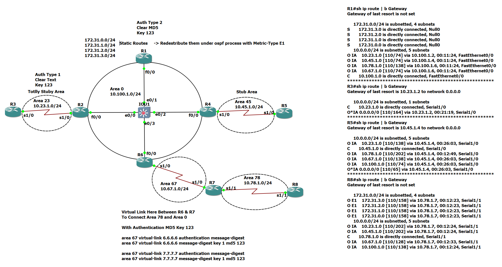

# Enterprise OSPF Multi-Area Network Lab

## Overview

This project demonstrates an enterprise-grade OSPF multi-area network design using advanced routing concepts such as authentication, route redistribution, stub and totally stub areas, and virtual links. The topology simulates real-world ISP/enterprise scenarios focusing on scalability, security, and routing optimization.


## Topology




## Project Objectives

- Design scalable multi-area OSPF architecture
- Implement secure routing using authentication
- Configure route redistribution of external networks
- Optimize routing using stub and totally stub areas
- Establish virtual link connectivity between discontiguous areas
- Validate routing convergence and redundancy

## OSPF Areas Design

| Area | Type | Network |
|------|------|----------|
| Area 0 | Backbone | 10.100.1.0/24 |
| Area 23 | Totally Stub Area | 10.23.1.0/24 |
| Area 45 | Stub Area | 10.45.1.0/24 |
| Area 67 | Transit Area | 10.67.1.0/24 |
| Area 78 | Normal Area | 10.78.1.0/24 |

## Key Features

### Multi-Area OSPF Design
Hierarchical OSPF design using Area 0 as backbone with multiple connected areas to improve scalability and routing efficiency.

### Route Redistribution
Static routes configured on R1 were redistributed into OSPF using **External Type 1 (E1)**:

- 172.31.0.0/24
- 172.31.1.0/24
- 172.31.2.0/24
- 172.31.3.0/24

### OSPF Authentication
- **Type 1 (Plain Text Authentication)** used in Area 23
- **Type 2 (MD5 Authentication)** used in backbone and virtual link
- Ensures secure neighbor adjacency and prevents unauthorized routing updates

### Totally Stub Area (Area 23)
Configured as:

```bash
area 23 stub no-summary
```

- Blocks Type 3, 4, and 5 LSAs
- Only receives default route from ABR
- Reduces routing table size significantly
- Optimized for low-resource or branch networks

### Stub Area (Area 45)
- Configured as a standard stub area
- Prevents external LSA flooding
- Improves performance and reduces overhead

### Virtual Link
- Established between R6 and R7 via Area 67
- Used to connect Area 78 to OSPF backbone (Area 0)
- Ensures continuity in non-contiguous backbone design

## Verification & Testing

- OSPF neighbor adjacency establishment
- Intra/inter-area routing validation
- External route propagation (E1)
- Default route injection in stub/totally stub areas
- Authentication validation (MD5 & plain text)
- End-to-end connectivity testing

## Skills Demonstrated

- Advanced Cisco Routing (OSPF)
- Enterprise Network Design
- OSPF Area Types (Stub, Totally Stub)
- Route Redistribution (E1 External Routes)
- Network Security (OSPF Authentication)
- Virtual Link Configuration
- Network Troubleshooting & Validation

## Technologies Used

- Cisco IOS
- OSPFv2
- Static Routing
- Route Redistribution
- MD5 Authentication
- Stub & Totally Stub Areas
- Virtual Links


## Professional Summary

Designed and implemented a secure and scalable enterprise OSPF multi-area network consisting of backbone, stub, and totally stub areas. Configured advanced routing features including authentication, route redistribution, and virtual links to simulate real-world enterprise routing scenarios. Verified full network convergence and optimized routing performance across all domains.

## About Me

**Mohamed Gamil**

- CCNA Certified
- CCNP Certified
- Network & Security Engineer
- Web & Network Penetration Tester

📧 Email: mmm845162@gmail.com
